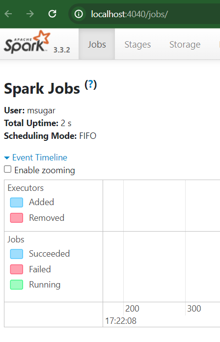

# Week 5 Homework Answers

## Setup
This procedure uses SDKMAN to make it easier to install and upgrade versions of Java and Spark. Note the installation of Spark already includes PySpark.
1. Install [SDKMAN](https://sdkman.io):
    ```
    curl -s "https://get.sdkman.io" | bash
    source "$HOME/.sdkman/bin/sdkman-init.sh"
    ```
1. Using SDKMAN, install Java 11 and Spark 3.3.2:
    ```
    sdk install java 11.0.22-tem
    sdk install spark 3.3.2
    ```
1. Open a new terminal or run the following in the same shell:
    ```
    source "$HOME/.sdkman/bin/sdkman-init.sh"
    ```
1. Verify the location and versions of Java and Spark that were installed:
    ```
    echo $JAVA_HOME
    java -version

    echo $SPARK_HOME
    spark-submit --version
    ```
1. Run the following command to test spark-submit:
    ```
    spark-submit --class org.apache.spark.examples.SparkPi $SPARK_HOME/examples/jars/spark-examples_2.12-3.3.2.jar
    ```
    If everything goes well, you should see the message “Pi is roughly 3.1…” in the result somehwere.
1. To test Spark with Scala code, execute `spark-shell` and run the following:
    ```
    val data = 1 to 10000
    val distData = sc.parallelize(data)
    distData.filter(_ < 10).collect()
    ```
    You should see as a result:
    ```
    res0: Array[Int] = Array(1, 2, 3, 4, 5, 6, 7, 8, 9)
    ```
    Hit `Ctrl + D` to quit `spark-shell`.
1. To test Spark with Python code (borrowed from [pyspark.md](https://github.com/DataTalksClub/data-engineering-zoomcamp/blob/main/05-batch/setup/pyspark.md)):
    - Download a CSV file that we'll use for testing:
        ```bash
        wget https://s3.amazonaws.com/nyc-tlc/misc/taxi+_zone_lookup.csv
        ``` 
    - Execute `pyspark` and run the following:
        ```
        import pyspark
        from pyspark.sql import SparkSession

        spark = SparkSession.builder \
            .master("local[*]") \
            .appName('test') \
            .getOrCreate()

        df = spark.read \
            .option("header", "true") \
            .csv('taxi+_zone_lookup.csv')

        df.show()
        ```
        You should see something like:
        ```
        +----------+-------------+--------------------+------------+
        |LocationID|      Borough|                Zone|service_zone|
        +----------+-------------+--------------------+------------+
        |         1|          EWR|      Newark Airport|         EWR|
        |         2|       Queens|         Jamaica Bay|   Boro Zone|
        |         3|        Bronx|Allerton/Pelham G...|   Boro Zone|
        |         4|    Manhattan|       Alphabet City| Yellow Zone|
        |         5|Staten Island|       Arden Heights|   Boro Zone|
        |         6|Staten Island|Arrochar/Fort Wad...|   Boro Zone|
        |         7|       Queens|             Astoria|   Boro Zone|
        |         8|       Queens|        Astoria Park|   Boro Zone|
        |         9|       Queens|          Auburndale|   Boro Zone|
        |        10|       Queens|        Baisley Park|   Boro Zone|
        |        11|     Brooklyn|          Bath Beach|   Boro Zone|
        |        12|    Manhattan|        Battery Park| Yellow Zone|
        |        13|    Manhattan|   Battery Park City| Yellow Zone|
        |        14|     Brooklyn|           Bay Ridge|   Boro Zone|
        |        15|       Queens|Bay Terrace/Fort ...|   Boro Zone|
        |        16|       Queens|             Bayside|   Boro Zone|
        |        17|     Brooklyn|             Bedford|   Boro Zone|
        |        18|        Bronx|        Bedford Park|   Boro Zone|
        |        19|       Queens|           Bellerose|   Boro Zone|
        |        20|        Bronx|             Belmont|   Boro Zone|
        +----------+-------------+--------------------+------------+
        only showing top 20 rows
        ```
    - Still in the `pyspark` shell, test that writing works as well:
        ```
        df.write.parquet('zones')
        ```
    - Hit `Ctrl + D` to quit `pyspark` shell.
    - You should see a `zones` folder with a parquet file inside.

## Question 1
- Run program [q01.py](q01.py):
    ```
    pyspark < q01.py
    ```
    Output:
    ```
    spark.version='3.3.2'
    ```
- Answer is *3.3.2*.

## Question 2
- Download data file:
    ```
    wget https://github.com/DataTalksClub/nyc-tlc-data/releases/download/fhv/fhv_tripdata_2019-10.csv.gz
    ```
- Run program [q02.py](q02.py):
    ```
    pyspark < q02.py
    ```
- List generated Parquet files:
    ```
    ls -lh q02_output/*.parquet
    ```
    Results:
    ```
    -rw-r--r-- 1 msugar msugar 6.4M Mar  3 16:53 q02_output/part-00000-dfc902fc-9ba3-40e1-b941-edbf2a01eae3-c000.snappy.parquet
    -rw-r--r-- 1 msugar msugar 6.4M Mar  3 16:53 q02_output/part-00001-dfc902fc-9ba3-40e1-b941-edbf2a01eae3-c000.snappy.parquet
    -rw-r--r-- 1 msugar msugar 6.4M Mar  3 16:53 q02_output/part-00002-dfc902fc-9ba3-40e1-b941-edbf2a01eae3-c000.snappy.parquet
    -rw-r--r-- 1 msugar msugar 6.4M Mar  3 16:53 q02_output/part-00003-dfc902fc-9ba3-40e1-b941-edbf2a01eae3-c000.snappy.parquet
    -rw-r--r-- 1 msugar msugar 6.4M Mar  3 16:53 q02_output/part-00004-dfc902fc-9ba3-40e1-b941-edbf2a01eae3-c000.snappy.parquet
    -rw-r--r-- 1 msugar msugar 6.4M Mar  3 16:53 q02_output/part-00005-dfc902fc-9ba3-40e1-b941-edbf2a01eae3-c000.snappy.parquet
    ```
- Answer is *6.4 Mbytes*.

## Question 3
- Run program [q03.py](q03.py):
    ```
    pyspark < q03.py
    ```
    Output:
    ```
    oct15_count=62610
    ```
- Answer is *62,610*.

## Question 4
- Run program [q04.py](q04.py):
    ```
    pyspark < q04.py
    ```
    Output:
    ```
    +---------------------+
    |longest_trip_in_hours|
    +---------------------+
    |        631152.500000|
    +---------------------+
    ```
- Answer is *631,152.5 hours*.

## Question 5:

- Answer is *4040*.

## Question 6:
- If it exists, delete the `zones` subfolder you might have created when testing PySpark:
    ```
    rm -fr zones
    ```
- Download the zone lookup data:
    ```
    wget https://github.com/DataTalksClub/nyc-tlc-data/releases/download/misc/taxi_zone_lookup.csv
    ```
- Run program [q06.py](q06.py):
    ```
    pyspark < q06.py
    ```
    Output:
    ```
    +-----------+------------+
    |       Zone|pickup_count|
    +-----------+------------+
    |Jamaica Bay|           1|
    +-----------+------------+
    ```
- Answer is *Jamaica Bay*.
